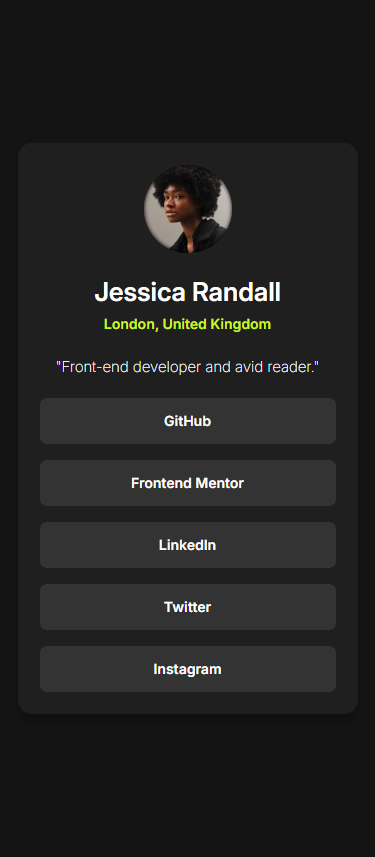
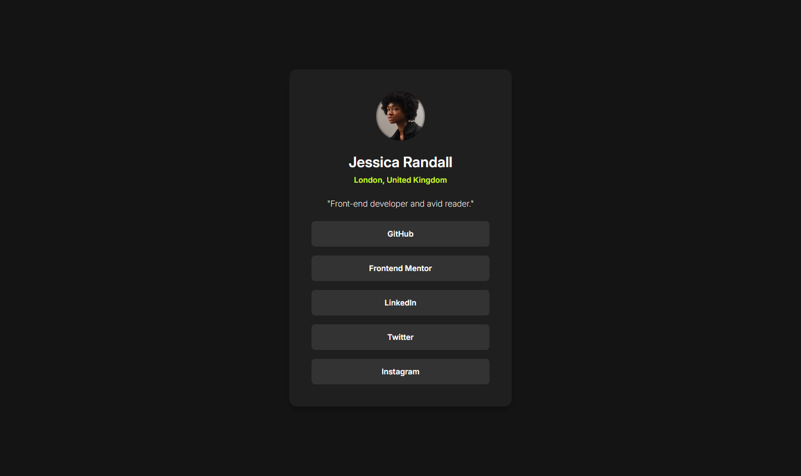

# Frontend Mentor - Social links profile solution

This is a solution to the [Social links profile challenge on Frontend Mentor](https://www.frontendmentor.io/challenges/social-links-profile-UG32l9m6dQ). Frontend Mentor challenges help you improve your coding skills by building realistic projects. 

## Table of contents

- [Overview](#overview)
  - [The challenge](#the-challenge)
  - [Screenshot](#screenshot)
  - [Links](#links)
- [My process](#my-process)
  - [Built with](#built-with)
  - [What I learned](#what-i-learned)
  - [Continued development](#continued-development)
  - [Useful resources](#useful-resources)
- [Author](#author)

## Overview

### The challenge

Users should be able to:

- See hover and focus states for all interactive elements on the page

### Screenshot

#### Mobile - 375px



#### Desktop - 1440px



### Links

- [Github Repo](https://github.com/Leondvin/social-links-profile-solution)
- [Live site URL - Github Pages](https://leondvin.github.io/social-links-profile-solution/)

## My process

### Built with

- Semantic HTML5 markup
- CSS custom properties (variables)
- Flexbox
- CSS Grid
- Mobile-first workflow
- [CSS relative color syntax](#what-i-learned)
- [Overlay using Pseudo-element](#what-i-learned) `::after`
- [CSS reset (Updated Eric Meyer's)](#what-i-learned)


### What I learned

I experimented with the **CSS relative color syntax** to convert rgb to hsl, and set an opacity.

```css
:root {
  --black: rgb(0, 0, 0);
  --card-box-shadow-color: hsl(from var(--black) h s l / .2);
  /* CSS rules */
}
```

Using an overlay pseudo-element, `::after` an inner shadow can be added on top of the `img` element.

But a pseudo-element, e.g. `::after`, cannot be added directly to `img` since `img` is one of the [**replaced elements**](https://developer.mozilla.org/en-US/docs/Glossary/Replaced_elements). Therefore, to get away from that caveat, a wrapping `div` element can be used instead.

```html
<div class="img-container">
  
</div>
```

By nature, `img` elements sit on the text baseline, and allocate an extra bottom gap to accomodate text descenders. To get rid of that unwanted space, the `img` element should be converted into a block-level element.

```css
img {
  display: block;
  /* CSS rules */
}
```

> **Note** : Converting the `img` element into a block-level element doesn't affect its **replaced element** status.

CSS reset takes care of **normalization**, so it's a good practice to separate its content from **design decisions**, which belong to the main stylesheet.

> **Note** : The `box-sizing` property is often considered to be normalization.

### Continued development

Further experimentation on pseudo-elements could help build an intuitive approach when looking others' code.

### Useful resources

- [Youtube - Kevin Powell - Stop using the legacy color syntax](https://www.youtube.com/watch?v=Uynb7Ci8JMg)

- [necocalc - PX to REM converter (Bi-directional)](https://nekocalc.com/px-to-rem-converter)

- [css-tricks - CSS Box Shadow](https://css-tricks.com/snippets/css/css-box-shadow/)

## Author

- Github - [@Leondvin](https://github.com/Leondvin)
- Frontend Mentor - [@Leondvin](https://www.frontendmentor.io/profile/Leondvin)
